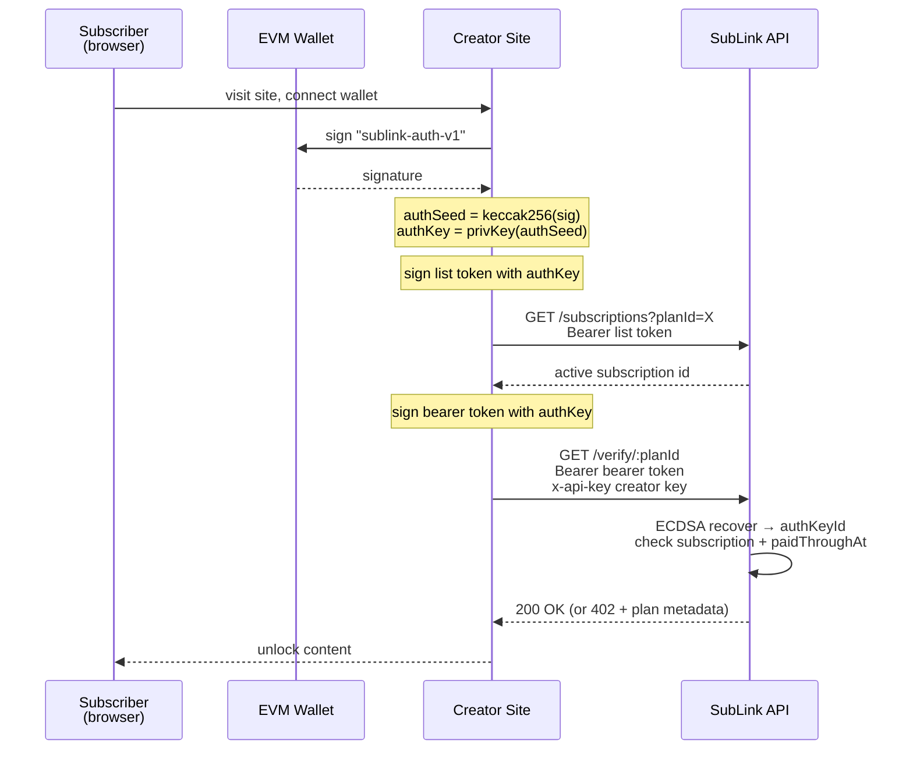

# SubLink

SubLink is a privacy-preserving subscription protocol powered by Unlink private transfers on Base Sepolia.

* https://sublink.lol - Creator / Subscriber UI
* https://explorer.sublink.lol - Admin explorer (public)
* https://creator-1.sublink.lol - Creator 1 Demo Page

## Monorepo Layout

- `frontend/` - main SubLink frontend (Vue + Vite)
- `backend/` - Bun + TypeScript API, SQLite state, cron charger, verification API
- `ops/` - manual scripts for creator setup, subscribe flow, bearer token, and demo orchestration
- `mock-sites/` - demo creator sites (see [Creators](#creators))

## Root Commands

- `bun run dev:frontend` - run frontend dev server
- `bun run backend` - run backend API (simple run mode)
- `bun run backend:dev` - run backend with watch mode
- `bun run check` - typecheck frontend + backend
- `bun run test` - run frontend + backend tests
- `bun run build` - build frontend
- `bun run build:site-a` - build creator site A
- `bun run build:site-b` - build creator site B

## How It Works

### Accounts

Each participant has two types of accounts:

**EVM Wallet** — a standard Ethereum wallet (private key). Used to sign messages and approve on-chain ERC-20 transfers. This is the subscriber's or creator's "real" identity.

**Unlink Account** — a privacy-preserving account on the Unlink protocol. Created from a deterministic seed so it can be re-derived without storing extra keys. Holds private USDC balance and can send/receive private transfers. Neither the sender, receiver, nor amount are visible on-chain.

Creators register one Unlink account when they set up. Subscribers derive a **dedicated Unlink account per plan** — the wallet signs `"sublink:<planId>"`, the result is hashed with Keccak256 to produce a seed, which together with a deterministic index creates the Unlink account. This means each subscription gets its own isolated funding source.

### Auth Key

The auth key is a secp256k1 keypair derived deterministically from the subscriber's EVM wallet:

1. Wallet signs the message `"sublink-auth-v1"`
2. `authSeed = Keccak256(signature)`
3. `authAccount = PrivateKeyAccount(authSeed)` — a full secp256k1 keypair
4. `authKeyId = last 20 bytes of Keccak256(uncompressed public key without 0x04 prefix)` — same derivation as an Ethereum address

The auth key is stable for a given wallet — re-deriving it always produces the same keypair. It serves as the subscriber's identity within SubLink without exposing their EVM address.

### Subscribing (Proof of Auth Key Ownership)

When subscribing, the client proves ownership of the auth key by signing a proof message:

```
sublink-subscribe-v1:<planId>:<unlinkAddress>:<authKeyId>
```

The server verifies that:
1. The `authPublicKey` hashes to the claimed `authKeyId`
2. ECDSA recovery on the signature yields the same `authKeyId`

This binds the subscription to a specific auth key and Unlink address. The server also receives the dedicated account's encrypted keys so it can execute charges on the subscriber's behalf via cron.

### Bearer Token (Ongoing Authentication)

After subscribing, the subscriber authenticates with a self-issued bearer token:

```
Authorization: Bearer <subscriptionId>.<expiry>.<signature>
```

Where `signature` is ECDSA over the message `sublink-bearer-v1:<subscriptionId>:<expiry>`, signed with the auth private key.

The server recovers the `authKeyId` from the signature — no server-side token storage. Tokens expire after 24h (configurable), with 30s clock skew tolerance.

### Creator Verification

Creators verify subscriber access from their backend via `GET /verify/:planId`. This requires two credentials:

- **`x-api-key` header** — the creator's API key (32 random hex chars, issued at creator registration). Proves the caller is the plan's owner.
- **`Authorization: Bearer` header** — the subscriber's bearer token, forwarded by the creator's site.

The server checks: API key matches the plan's creator, bearer token is valid, recovered `authKeyId` matches the subscription, the subscription belongs to this plan, and the subscriber's `paidThroughAt` is still in the future.

If the subscriber has no token or an invalid one, the endpoint returns a 402 with plan metadata and the SubLink API URL — a discovery response the frontend can use to prompt subscription.

### End-to-End Access Flow



Both tokens use the same format — `<id>.<expiry>.<sig>` where `sig` is ECDSA over `sublink-bearer-v1:<id>:<expiry>` signed with the auth key. They differ only in scope:

- **List token** (`id = "list"`) — used once to ask SubLink which subscription this auth key has for a given plan.
- **Bearer token** (`id = <subscriptionId>`) — used to prove ongoing access to a specific subscription. Sent on every verify call.

## Creators

- [Site A](https://site-a.sublink.lol) — TODO
- [Site B](https://site-b.sublink.lol) — TODO

## Q&A

**Do I need to generate a new account for my Unlink wallet or auth key?**

No. Both are derived deterministically from your existing EVM wallet. Your Unlink account is created by signing `"sublink:<planId>"` — the signature is hashed to produce a seed that generates the account. Your auth key is derived by signing `"sublink-auth-v1"`. As long as you have your EVM wallet, you can always re-derive both. No extra keys to generate or back up.

**Does anyone see my Unlink account private key?**

The SubLink backend receives your dedicated Unlink account keys so it can execute recurring charges on your behalf. Nobody else — not the creator, not on-chain observers — can see them. This is the current trust tradeoff: you trust the SubLink backend to only charge according to plan terms. A future TEE upgrade would protect keys even from the server operator. You can also cancel anytime or withdraw your USDC from the dedicated account to cut off access.

**How does the creator know I paid my subscription?**

The creator never sees the payment directly — Unlink transfers are private on-chain. Instead, the creator's site calls SubLink's `/verify/:planId` endpoint with your bearer token and the creator's API key. SubLink checks that your auth key matches the subscription and that the subscription is still paid through right now. The creator learns that you currently have access without learning your identity, wallet address, or payment details.

**Why is a separate auth key needed? Can't the Unlink account handle authentication?**

Your Unlink account keys are shared with the SubLink backend so it can charge you on schedule. If you also used those same keys to sign bearer tokens, anyone who intercepts a token could recover the key material — and now they have the keys that control your funds. With a separate auth key, the worst case of a leaked bearer token is someone proving they have your subscription — they can't touch your money. It's the same reason you don't use your bank card PIN as your website password: keep the thing that moves money separate from the thing that proves identity.

## Required Env Vars

- `UNLINK_API_KEY` — Unlink protocol API key
- `UNLINK_API_ENDPOINT` — Unlink engine URL

### Debug / Ops Scripts Only

- `DEPLOYER` — private key for deploying contracts
- `ALICE` — subscriber wallet private key
- `BOB` — creator/receiver wallet private key
