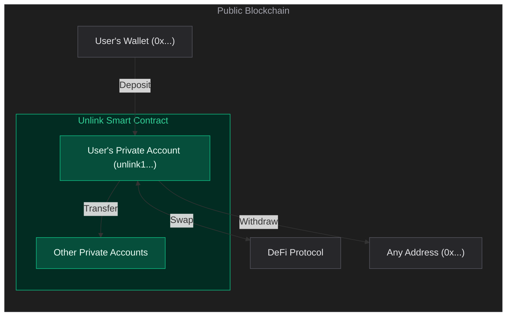

# Burner Wallet
Source: https://docs.unlink.xyz/burner

Disposable EOAs for temporary DeFi interactions.

Disposable EOAs for temporary DeFi interactions without exposing your main account.

**Lifecycle:** create, fund from pool, interact with DeFi, deposit back, dispose.

## Create a burner

```ts theme={null}
import { BurnerWallet } from "@unlink/sdk";

const burner = await BurnerWallet.create();
// burner.address - the ephemeral EOA address
```

Pass a custom `BurnerStorage` implementation for persistence (default is in-memory):

```ts theme={null}
const burner = await BurnerWallet.create(myStorage);
```

## Restore a burner

```ts theme={null}
const burner = await BurnerWallet.restore("0xBurnerAddress", myStorage);
// Returns null if not found in storage
```

## Use with viem

```ts theme={null}
const viemAccount = burner.toViemAccount();
// Use viemAccount with a WalletClient for DeFi interactions
```

## Fund from privacy pool

Withdraw tokens from the pool to fund the burner. Requires a low-level `Client` (from `createUnlinkClient`) and sender account keys.

```ts theme={null}
import { createUnlinkClient } from "@unlink/sdk";

const client = createUnlinkClient(engineUrl, apiKey);
const result = await burner.fundFromPool(client, {
  senderKeys: accountKeys,
  token: "0xTokenAddress",
  amount: "1000000000000000000",
  environment: "base-sepolia",
});
```

## Deposit back to pool

After your DeFi interactions, deposit tokens back into the privacy pool:

```ts theme={null}
const result = await burner.depositToPool(client, {
  unlinkAddress: "unlink1...",
  token: "0xTokenAddress",
  amount: "1000000000000000000",
  environment: "base-sepolia",
  chainId: 84532,
  permit2Address: "0x000000000022D473030F116dDEE9F6B43aC78BA3",
  poolAddress: "0xPoolAddress",
  deadline: Math.floor(Date.now() / 1000) + 3600,
});
```

## Check status and dispose

```ts theme={null}
const status = await burner.getStatus(client);

await burner.dispose(client, depositBackTxId);
await burner.deleteKey(); // Remove private key from storage
```

## Get chain info

```ts theme={null}
const info = await BurnerWallet.getInfo(client);
// Chain configuration for burner operations
```


# Deposit
Source: https://docs.unlink.xyz/deposit

Move ERC-20 tokens from an EVM wallet into the privacy pool.

Deposit ERC-20 tokens into the privacy pool. Lazily registers the user on first call.

```ts theme={null}
const result = await unlink.deposit({
  token: "0xTokenAddress",
  amount: "1000000000000000000",
});

const confirmed = await unlink.pollTransactionStatus(result.txId);
```

## Parameters

| Parameter  | Type                | Required | Description                                                   |
| ---------- | ------------------- | -------- | ------------------------------------------------------------- |
| `token`    | `string`            | Yes      | ERC-20 token address                                          |
| `amount`   | `string`            | Yes      | Amount in wei                                                 |
| `deadline` | `number`            | No       | Permit2 deadline (unix seconds). Defaults to 1 hour from now. |
| `nonce`    | `string`            | No       | Override Permit2 nonce (auto-managed by default)              |
| `evm`      | `UnlinkEvmProvider` | No       | Override the EVM provider for this call                       |

**Returns:** `{ txId: string; status: TransactionStatus }`

## Approvals

Before the first deposit of a given token, the token must be approved for Permit2 on-chain. The SDK provides helpers:

```ts theme={null}
const result = await unlink.ensureErc20Approval({
  token: "0xTokenAddress",
  amount: "1000000000000000000",
});

if (result.status === "submitted") {
  // Wait for tx to be mined before depositing
  console.log("Approval tx:", result.txHash);
}
```

This is a one-time step per token. After approval, all future deposits use gasless Permit2 signatures.

You can also check the approval state or build the transaction manually:

```ts theme={null}
const state = await unlink.getApprovalState({ token, amount });
// state.isApproved: boolean

const tx = await unlink.buildApprovalTx({ token, amount });
// tx: { to: string; data: string; value?: bigint }
```

<Note>
  Approval methods require an EVM provider with `getErc20Allowance`. `ensureErc20Approval` also requires `sendTransaction`.
</Note>


# Execute
Source: https://docs.unlink.xyz/execute

Call external smart contracts from your private balance.

Execute arbitrary smart contract calls from your private balance. This enables DeFi interactions (swaps, lending, etc.) while keeping the sender private.

```ts theme={null}
const result = await unlink.execute({
  token: "0xTokenAddress",
  amount: "1000000000000000000",
  calls: [
    {
      to: "0xDeFiProtocol",
      data: "0x...",
      value: "0",
    },
  ],
});

const confirmed = await unlink.pollTransactionStatus(result.txId);
```

<Note>
  Execute exposes amount, recipient, and token type on-chain (since it calls an external contract), but keeps the sender private.
</Note>


# Introduction
Source: https://docs.unlink.xyz/index

Build private applications on any blockchain.

Unlink lets you add private blockchain wallets to your app. Your users can own accounts, send and receive tokens privately, and interact with smart contracts, all without exposing balances or transaction history.

## What you can build

* **Neobank** - On-chain banking where users' financial activity stays private
* **Payroll** - Salaries and contractor payments that stay confidential
* **DeFi** - Trading, borrowing, and lending without exposing positions or strategy
* **Treasury** - Organizational fund management without revealing strategic decisions
* **Stablecoin payments** - Move dollars on-chain while keeping balances private
* **OTC trading** - Settle peer-to-peer trades privately
* **Donations & grants** - Let users support causes without linking their identity
* **AI agents** - Autonomous agents that execute confidential transactions

## How Unlink works



Unlink is a smart contract deployed on the blockchain itself. No bridging, no separate chain. The SDK handles all proof generation and signing. From a builder's perspective you call `deposit()`, `transfer()`, `withdraw()`, and `execute()`.

<Info>
  **What's private, what's public**

  |                | Deposit                | Transfer               | Withdraw               | Execute                |
  | -------------- | ---------------------- | ---------------------- | ---------------------- | ---------------------- |
  | **Amount**     | Public                 | <Badge>Private</Badge> | Public                 | Public                 |
  | **Sender**     | Public                 | <Badge>Private</Badge> | <Badge>Private</Badge> | <Badge>Private</Badge> |
  | **Recipient**  | <Badge>Private</Badge> | <Badge>Private</Badge> | Public                 | Public                 |
  | **Token type** | Public                 | <Badge>Private</Badge> | Public                 | Public                 |
</Info>

<CardGroup>
  <Card title="Quickstart" icon="rocket" href="/quickstart">
    Install the SDK and make your first deposit, transfer, and withdrawal.
  </Card>

  <Card title="Deposit" icon="arrow-down-to-bracket" href="/deposit">
    Move ERC-20 tokens from an EVM wallet into the privacy pool.
  </Card>

  <Card title="Transfer" icon="paper-plane" href="/transfer">
    Send tokens privately between Unlink addresses.
  </Card>

  <Card title="Withdraw" icon="arrow-up-from-bracket" href="/withdraw">
    Move tokens from the privacy pool to any EVM address.
  </Card>

  <Card title="Execute" icon="arrows-rotate" href="/execute">
    Call external smart contracts from your private balance.
  </Card>

  <Card title="Burner Wallet" icon="fire" href="/burner">
    Disposable EOAs for temporary DeFi interactions.
  </Card>
</CardGroup>


# Quickstart
Source: https://docs.unlink.xyz/quickstart

Install the SDK and make your first private transaction in minutes.

<Note>
  API keys are currently distributed manually. Contact the Unlink team to get access.
</Note>

## Network

Unlink is live on **Base Sepolia**.

| Resource         | Value                                        |
| ---------------- | -------------------------------------------- |
| **Network**      | Base Sepolia                                 |
| **Chain ID**     | `84532`                                      |
| **API URL**      | `https://api.unlink.io`                      |
| **Pool Address** | `0x647f9b99af97e4b79DD9Dd6de3b583236352f482` |

<CardGroup>
  <Card title="Faucet" icon="faucet" href="https://faucet.unlink.xyz">
    Get testnet tokens for development.
  </Card>

  <Card title="Base Sepolia faucet" icon="droplet" href="https://www.alchemy.com/faucets/base-sepolia">
    Get testnet ETH for gas.
  </Card>
</CardGroup>

## Prerequisites

Make sure you have:

* Node.js v18 or later
* A package manager (npm, pnpm, yarn, or bun)
* A TypeScript project

<Accordion title="Don't have a project yet?">
  <CodeGroup>
    ```bash Vite theme={null}
    npm create vite@latest my-app -- --template react-ts
    cd my-app
    ```

    ```bash Next.js theme={null}
    npx create-next-app@latest my-app --typescript
    cd my-app
    ```

    ```bash Node.js theme={null}
    mkdir my-app && cd my-app
    npm init -y
    npm install typescript tsx
    ```
  </CodeGroup>
</Accordion>

<Steps>
  <Step title="Install">
    <CodeGroup>
      ```bash npm theme={null}
      npm install @unlink/sdk viem
      ```

      ```bash pnpm theme={null}
      pnpm add @unlink/sdk viem
      ```

      ```bash yarn theme={null}
      yarn add @unlink/sdk viem
      ```

      ```bash bun theme={null}
      bun add @unlink/sdk viem
      ```
    </CodeGroup>
  </Step>

  <Step title="Create a client">
    The SDK works anywhere JavaScript runs. Choose the setup that fits your environment:

    <Tabs>
      <Tab title="Server-side (Node.js)">
        Use a private key and viem for backends, scripts, bots, or AI agents.

        ```ts theme={null}
        import { createUnlink, unlinkAccount, unlinkEvm } from "@unlink/sdk";
        import { createPublicClient, createWalletClient, http } from "viem";
        import { privateKeyToAccount } from "viem/accounts";
        import { baseSepolia } from "viem/chains";

        const evmAccount = privateKeyToAccount(
          process.env.EVM_PRIVATE_KEY as `0x${string}`,
        );

        const walletClient = createWalletClient({
          account: evmAccount,
          chain: baseSepolia,
          transport: http(process.env.RPC_URL),
        });

        const publicClient = createPublicClient({
          chain: baseSepolia,
          transport: http(process.env.RPC_URL),
        });

        const unlink = await createUnlink({
          engineUrl: "https://api.unlink.io",
          apiKey: process.env.UNLINK_API_KEY!,
          account: unlinkAccount.fromMnemonic({
            mnemonic: process.env.UNLINK_MNEMONIC!,
          }),
          evm: unlinkEvm.fromViem({
            walletClient,
            publicClient,
          }),
        });
        ```
      </Tab>

      <Tab title="Browser (ethers)">
        Connect to the user's wallet via MetaMask or any injected provider.

        ```ts theme={null}
        import { createUnlink, unlinkAccount, unlinkEvm } from "@unlink/sdk";
        import { BrowserProvider } from "ethers";

        const browserProvider = new BrowserProvider(window.ethereum);
        const signer = await browserProvider.getSigner();

        const unlink = await createUnlink({
          engineUrl: "https://api.unlink.io",
          apiKey: process.env.UNLINK_API_KEY!,
          account: unlinkAccount.fromMnemonic({
            mnemonic: process.env.UNLINK_MNEMONIC!,
          }),
          evm: unlinkEvm.fromEthers({
            signer,
          }),
        });
        ```
      </Tab>

      <Tab title="Browser (viem)">
        Connect to the user's wallet via viem's browser wallet client.

        ```ts theme={null}
        import { createUnlink, unlinkAccount, unlinkEvm } from "@unlink/sdk";
        import { createPublicClient, createWalletClient, custom, http } from "viem";
        import { baseSepolia } from "viem/chains";

        const walletClient = createWalletClient({
          chain: baseSepolia,
          transport: custom(window.ethereum),
        });

        const publicClient = createPublicClient({
          chain: baseSepolia,
          transport: http(),
        });

        const unlink = await createUnlink({
          engineUrl: "https://api.unlink.io",
          apiKey: process.env.UNLINK_API_KEY!,
          account: unlinkAccount.fromMnemonic({
            mnemonic: process.env.UNLINK_MNEMONIC!,
          }),
          evm: unlinkEvm.fromViem({
            walletClient,
            publicClient,
          }),
        });
        ```
      </Tab>
    </Tabs>

    Use `unlinkAccount.fromSeed(...)` or `unlinkAccount.fromKeys(...)` when you already manage seed material or raw account keys outside the SDK.
  </Step>

  <Step title="Deposit">
    Approve the token for Permit2 (one-time per token), then deposit:

    ```ts theme={null}
    const approval = await unlink.ensureErc20Approval({
      token: "0xYourToken",
      amount: "1000000000000000000",
    });

    if (approval.status === "submitted") {
      await publicClient.waitForTransactionReceipt({
        hash: approval.txHash as `0x${string}`,
      });
    }

    const deposit = await unlink.deposit({
      token: "0xYourToken",
      amount: "1000000000000000000",
    });

    const confirmed = await unlink.pollTransactionStatus(deposit.txId);
    ```

    See [Deposit](/deposit) for all parameters and options.
  </Step>

  <Step title="Transfer">
    Send tokens privately to another Unlink address:

    ```ts theme={null}
    const transfer = await unlink.transfer({
      recipientAddress: "unlink1recipient...",
      token: "0xYourToken",
      amount: "250000000000000000",
    });

    const confirmed = await unlink.pollTransactionStatus(transfer.txId);
    ```

    See [Transfer](/transfer) for multi-recipient transfers.
  </Step>

  <Step title="Withdraw">
    Move tokens back to any EVM address:

    ```ts theme={null}
    const withdrawal = await unlink.withdraw({
      recipientEvmAddress: "0xRecipient",
      token: "0xYourToken",
      amount: "500000000000000000",
    });

    const confirmed = await unlink.pollTransactionStatus(withdrawal.txId);
    ```

    See [Withdraw](/withdraw) for all parameters.
  </Step>
</Steps>


# Transfer
Source: https://docs.unlink.xyz/transfer

Send tokens privately between Unlink addresses.

Transfer tokens privately to one or more Unlink addresses. Sender, recipient, and amount are all hidden by a zero-knowledge proof.

## Single recipient

```ts theme={null}
const result = await unlink.transfer({
  recipientAddress: "unlink1...",
  token: "0xTokenAddress",
  amount: "500000000000000000",
});

const confirmed = await unlink.pollTransactionStatus(result.txId);
```

## Multiple recipients

```ts theme={null}
const result = await unlink.transfer({
  token: "0xTokenAddress",
  transfers: [
    { recipientAddress: "unlink1aaa...", amount: "100" },
    { recipientAddress: "unlink1bbb...", amount: "200" },
  ],
});
```

**Returns:** `{ txId: string; status: TransactionStatus }`


# Utilities
Source: https://docs.unlink.xyz/utilities

Read balances, transaction history, and other helper methods.

## Read balances

```ts theme={null}
const { balances } = await unlink.getBalances();
```

Filter by token:

```ts theme={null}
const { balances } = await unlink.getBalances({ token: "0xTokenAddress" });
```

## Read transactions

```ts theme={null}
const { transactions } = await unlink.getTransactions({
  status: "processed",   // optional
  type: "transfer",      // optional: "deposit" | "transfer" | "withdrawal"
  limit: 20,             // optional
  cursor: "...",         // optional, for pagination
});
```

## Poll transaction status

Poll until a transaction reaches a terminal state (`relayed`, `processed`, or `failed`).

```ts theme={null}
const result = await unlink.pollTransactionStatus(txId, {
  intervalMs: 2000,   // optional, default 2s
  timeoutMs: 60000,   // optional, default 60s
});
```

Throws if the timeout is reached before a terminal status.

## Get address

Get the Unlink address (Bech32m) for this account.

```ts theme={null}
const address = await unlink.getAddress();
// "unlink1..."
```

## Get public key

Get the spending public key (EdDSA on BabyJubJub).

```ts theme={null}
const [x, y] = await unlink.getPublicKey();
```

## Register user

Explicitly register the user with Unlink. Called automatically on first `deposit()`, but can be called manually.

```ts theme={null}
await unlink.ensureRegistered();
```

## Error handling

```ts theme={null}
import { UnlinkApiError, UnlinkCapabilityError } from "@unlink/sdk";

try {
  await unlink.deposit({ token, amount });
} catch (err) {
  if (err instanceof UnlinkApiError) {
    // Unlink returned an error
    console.error(err.code, err.message);
  }
  if (err instanceof UnlinkCapabilityError) {
    // Missing EVM provider capability (e.g. no sendTransaction)
    console.error(err.message);
  }
}
```


# Withdraw
Source: https://docs.unlink.xyz/withdraw

Move tokens from the privacy pool to any EVM address.

Withdraw tokens from the privacy pool to any EVM address.

```ts theme={null}
const result = await unlink.withdraw({
  recipientEvmAddress: "0xRecipient",
  token: "0xTokenAddress",
  amount: "500000000000000000",
});

const confirmed = await unlink.pollTransactionStatus(result.txId);
```

## Parameters

| Parameter             | Type     | Required | Description             |
| --------------------- | -------- | -------- | ----------------------- |
| `recipientEvmAddress` | `string` | Yes      | Destination EVM address |
| `token`               | `string` | Yes      | ERC-20 token address    |
| `amount`              | `string` | Yes      | Amount in wei           |

**Returns:** `{ txId: string; status: TransactionStatus }`


