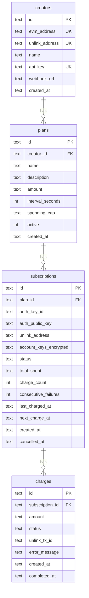
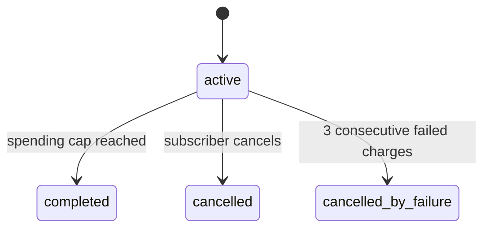

# SubLink Backend

## Data Model

**creators** -- service providers who publish plans and receive payments via their Unlink address.

**plans** -- subscription offers (amount, interval, optional spending cap). Public by design so subscribers can discover them.

**subscriptions** -- a subscriber's active relationship to a plan. Identified by a derived auth key, not a stored wallet address. Holds the dedicated Unlink account keys so the backend can pull payments. One per `(auth_key_id, plan)` pair.

**charges** -- individual payment attempts. Tracks success/failure, Unlink transaction ID, and timing. History is append-only.

### Subscription lifecycle

